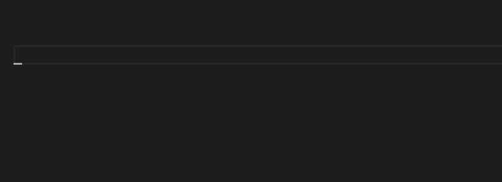

# VSCode Shell Syntax

Adds a linter for shell scripts that highlights syntax errors on save:

## Supported Languages

- bash
- zsh
- sh

## Related Projects

- [Fish](https://marketplace.visualstudio.com/items?itemName=bmalehorn.vscode-fish) extension, which lints fish files.
- [Shellcheck](https://marketplace.visualstudio.com/items?itemName=timonwong.shellcheck) extension, which provides advanced lint warnings but requires more commitment.
